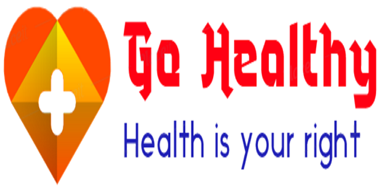
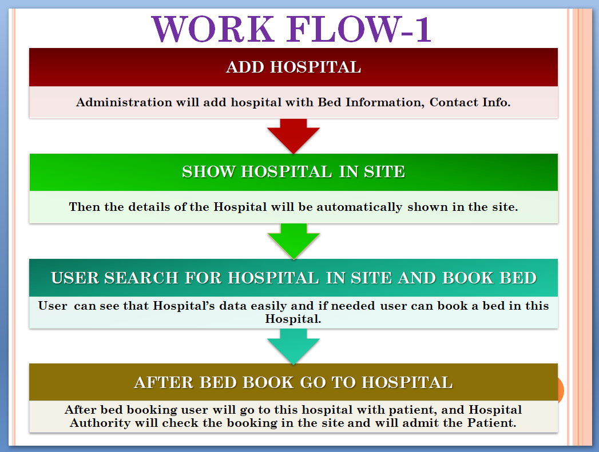
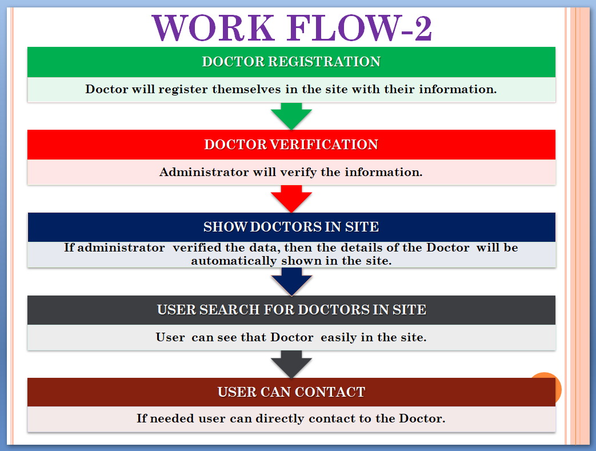
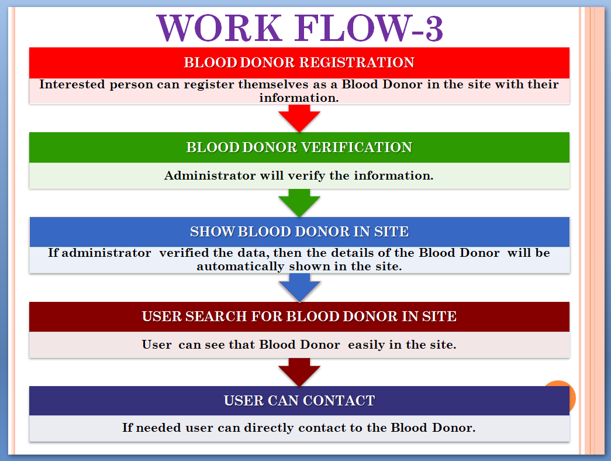

# Welcome to Go Healthy
## Health is Your Right
   
 
## We look forwards a time, when nobody dies due to insufficiency of Healthcare Service In India.
 
**_visit the site_** [GoHealthy](https://gohealthy.pythonanywhere.com/)
 ```
 Go Healthy is a website for medical support. Purpose of the website is to deliver all details about Bed and Antivenom availability in all hospitals,
 Doctors and Blood Donor near you and how to do first aid. This website has four different features.
 In Check Hospital section user can see the all information about all the Hospital and number of
 available bed in Hospital and also can book bed for patients and can see which hospital has Antivenom.
 In Find Doctor section user can see all the information about doctors of their location.
 And in Find Donor section user can see the all information about blood donors.
 In First Aid section there are several free videos and photos are available which will provide you a guide about First Aid.
 ```
## Current Situation of the Healthcare System
   
India ranked 145 out of 195 countries in Healthcare Access and Quality Index. Since Independent no serious effective action has been taken by Government to improve the healthcare system. As a result a huge number of people are depriving from the healthcare service. We believe that it is everybody's right to get the healthcare services easily. Every month Many patients lose their lives because they don't get bed in hospital, don't get Blood, don't get medical support; and many snake bitten patients die due to no Antivenom in hospitals.

**Data Says that -**

* Bed availability of India is only 5 beds for 10,000 people. In Human Development Report 2020, India ranked 155 out of 167 countries on Bed Availability.
* India has only 69,265 Hospitals. Just 25,778 Government Hospitals and 43,487 Private Hospitals.
* According to Human Development Index 2020, India has just 8.6 doctors for every 10,000 population.
* 27% death is for lack of Medical Attention - Data 2016.

## Problems in the Healthcare System

#### Patients died due to not being admitted to the Hospital within right time:
If you read news each day, you find such news that the patient died due to not getting bed in hospital. Patient parties keep running from one hospital to another hospital to admit the patient  - it consumes so many valuable times, but hospitals replies we have no more beds, and so that the patient dies. If the patient didn’t admit to the hospital, then how he’ll receive treatment? We also see that in many hospitals due to long admission process, it wastes the times.
#### Snake Bite Patients died due to not get Vaccine at right time:
In India every day average 200 people died due to Snake Bite, more than half of the death are caused by not getting vaccine within right time; Because in India all the Hospital have no Antivenom Vaccine. So for snake bitten patient it spends so many valuable times to find a hospital which hospital has Antivenom vaccine.
#### People do not able to contact doctor in emergency in many cases:
India doesn’t have sufficient doctors. As a result many people can’t contact to the doctors at the right time. Those who live far away from the hospital, for them, it is not possible to get medical support quickly. In that case they need to contact/ consult with a doctor to get medical support. But if they don’t have any such platform how do they do it? 
#### Patients died due to not receive Blood within right time:
Every day many patients are losing theirs life just for not being able to collect blood.  In India Blood Banks have not sufficient bloods, for that patients need to collect blood from donors. But it is impossible for them to contact a blood donor. Is the patient’s family go to everybody in their area and ask their blood group and request them to donate blood? If patient’s family do that, it will waste the time; and waste of time means the patient is certain to die.
#### The accident victims die due to not getting medical help at the right time:
In India each second accidents are happening. In most of the cases victims are died just for delay in Medical Assistant. Due to shortage MST, Traffic Jump, lack of Medical Infrastructure Medical Support Team do late in their works. 


So we are trying to develop a website to help the people those who are victim of the problems. To make a good future we are here with you to help you......

## Features on the Website to Deal with the Problems

#### See number of available bed in hospital and Book bed:
Imagine what happen, if you will know in advance, which hospital has a bed? Then you don’t need to run in several hospitals to admit the patient, you won’t get the reply, sorry sir we have no more bed. You don’t need to waste your time to travel in several hospitals. Just go to that hospital, which hospital have bed you already know from the site. It will save your time and save of time means the risk of death is low.

And before reaching to the hospital if you already book a bed, then in hospital you don’t need to waste your valuable time for a long Admission Process, just by a single click you can book a bed for the patient. It just likes Hotel Booking, if you book a bed in a hotel at online, the hotel will take less time to provide you a bed compare to offline booking.
  
Hence, if patient family easily can see which hospital has available bed, and easily can book a bed for patient, it will solve the **first problem** we mentioned – that is ***Patients died due to not being admitted to the Hospital within right time.***

#### Search Hospitals in your locality for Antivenom:
In most of the case, the cause of the snake bitten patient is delay in treatment or not getting vaccine within the right time. So there should be a system, by that people will able to know, in which hospital of his/her locality he/she will get Antivenom. Just by single click when you are able to know in which hospital of your area you will get treatment of Snake Bite, then you don’t need to waste your time to run from one hospital to another hospital to find a hospital which have vaccine. In this website we developed, any people can see which hospital has Antivenom. 

So this solution will solve the **second problem** - that is ***Snake Bite Patients died due to not get Vaccine at right time.***

#### Contact a Doctors in your locality:
In Problem Statement we already see that it is a challenge for the common people to contact a doctor in emergency. So to tackle this challenge we need to provide a platform, from where people can contact to any doctor. And we put this platform in our idea i.e. on the website.

When you will be able to search doctors in your locality and also contact a doctor just by single click, then easily you can get a medical advice when you are living far from hospital. And a Medical Advice can save a life.

Hence, this solution will solve the **third problem** - that is ***People do not able to contact a doctor in emergency in many cases.***

#### Contact a Blood Donors in your locality:
In the mentioned problems, we see that common people facing problems to collect Blood. To solve this problem by this website we provide a feature, By that people can easily connect to the nearest Blood Donor. When a people can easily contact to a correct blood donor within a minute, then it will save a lot of times. When a patient family successfully connect to a blood donor quickly, then the patient will receive blood quickly and early blood transfusion means reduced the risk of death.
	
So, this will solve the **fourth problem** - that is ***Patients died due to not receive Blood within right time.***

#### Learn First Aid:
In India Every day many patients died due to not get first aid treatment at right time - it already mentioned in the problem statement. What’s the Solution ? Well, a solution is - to make the common people aware of First Aid. If every citizen of India know How to do First Aid, then in emergency a person can help a victim by delivering First Aid to the victim. So if the Medical Assistance Team make delay to reach to the spot, then a common person can help the victim. For that we have to make a simple, easiest and multi-language learning platform, from where a common people can learn First Aid. When almost every people get the knowledge of first aid, then it will save the life of so many accident’s victims.

This solution will solve the **fifth problem** - that is ***The accident victims die due to not getting medical help at the right time.***


<h6>NOTE:</h6>The features on the website is not able to solve the whole problem totally. The features just give a relief to the people and help the people. And may reduce the number of death at a lower rate.<br>When Government will focus on these issues, only then the problem will solve totally.

# Work Flow
## Work Flow 1


## Work Flow 2


## Work Flow 3



## Suggestion or Contact

Do you have any better suggestion?
        
   Or
        
Do You need any help?

Email us: <a href="mailto:gohealthymail@gmail.com">gohealthymail@gmail.com</a>
